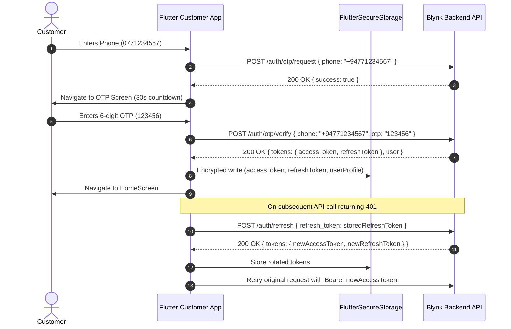

# Phase A: Frontend Network + Authentication Integration

## Executive Summary
Phase A successfully integrates the existing Blynk Flutter customer application (`apps/customer/blinkit-clone-Flutter-ecommerce-/`) with the live backend authentication system (`http://localhost:4000/api/v1`). All visual identity tokens, Catamaran typography, Lottie animations, and Atomic Design widget structures were preserved. Sri Lankan phone validation (+94 / 07XXXXXXXX) and currency (LKR / Rs.) were standardized across the client.

---

## 1. Files Inspected
- `apps/customer/blinkit-clone-Flutter-ecommerce-/lib/constants.dart`
- `apps/customer/blinkit-clone-Flutter-ecommerce-/lib/Infrastructure/HttpMethods/requesting_methods.dart`
- `apps/customer/blinkit-clone-Flutter-ecommerce-/lib/Infrastructure/AsyncAction/async_actions.dart`
- `apps/customer/blinkit-clone-Flutter-ecommerce-/lib/Services/Exceptions/api_exception.dart`
- `apps/customer/blinkit-clone-Flutter-ecommerce-/lib/Services/Providers/auth.provider.dart`
- `apps/customer/blinkit-clone-Flutter-ecommerce-/lib/Screens/Auth/login_screen.dart`
- `apps/customer/blinkit-clone-Flutter-ecommerce-/lib/Screens/Auth/otp_verification_screen.dart`
- `apps/customer/blinkit-clone-Flutter-ecommerce-/lib/UI/Widgets/Organisms/login_screen_otp_sheet.dart`
- `apps/customer/blinkit-clone-Flutter-ecommerce-/lib/UI/Widgets/Atoms/custom_text_field.dart`
- `apps/customer/blinkit-clone-Flutter-ecommerce-/lib/Screens/profile_screen.dart`
- `apps/customer/blinkit-clone-Flutter-ecommerce-/lib/UI/Widgets/Organisms/cupertino_logout_dialog.dart`
- `apps/customer/blinkit-clone-Flutter-ecommerce-/lib/route_generator.dart`
- `apps/customer/blinkit-clone-Flutter-ecommerce-/lib/main.dart`
- `apps/customer/blinkit-clone-Flutter-ecommerce-/pubspec.yaml`

---

## 2. Files Modified & Created

| File | Status | Description |
|---|---|---|
| `pubspec.yaml` | Modified | Added `.env` asset mapping. |
| `.env` | Created | Configured `API_BASE_URL=http://localhost:4000/api/v1`. |
| `lib/constants.dart` | Modified | Replaced `₹` with `Rs.` / `LKR`. Added `isValidSriLankanPhone()` and `formatToE164()`. |
| `lib/Services/Exceptions/api_exception.dart` | Modified | Enhanced exception class with status codes, error codes, and sanitized string conversion. |
| `lib/Infrastructure/HttpMethods/token_storage.dart` | Created | Encapsulated `FlutterSecureStorage` for encrypted storage of access tokens, refresh tokens, and cached user profile. |
| `lib/Infrastructure/HttpMethods/requesting_methods.dart` | Modified | Configured `Dio` with dynamic `baseUrl`, 15s timeouts, automatic `Bearer` token injection, single 401 refresh interceptor with loop protection, and safe error mapping. |
| `lib/Models/user_model.dart` | Created | Model representing user ID, phone, email, full name, role, and active status. |
| `lib/Services/Providers/auth.provider.dart` | Modified | Implemented `requestOtp()`, `verifyOtp()`, `refreshToken()`, `loadCurrentUser()`, `logout()`, and `restoreSession()`. |
| `lib/UI/Widgets/Atoms/custom_text_field.dart` | Modified | Changed default prefix from `+91` to `+94`. |
| `lib/UI/Widgets/Organisms/login_screen_otp_sheet.dart` | Modified | Wired `+94` phone validation and `AuthProvider.requestOtp()`. |
| `lib/Screens/Auth/login_screen.dart` | Modified | Updated copy to "Welcome to Blynk". Preserved Lottie animation and structure. |
| `lib/Screens/Auth/otp_verification_screen.dart` | Modified | Wired `AuthProvider.verifyOtp()`, 6-digit OTP verification, timer, resend OTP trigger, and navigation. |
| `lib/Screens/profile_screen.dart` | Modified | Connected to `AuthProvider.currentUser` to display real authenticated customer info. |
| `lib/UI/Widgets/Organisms/cupertino_logout_dialog.dart` | Modified | Wired to `AuthProvider.logout()`. |
| `lib/main.dart` | Modified | Initialized `dotenv`, configured `AuthProvider` with automatic session restoration. |
| `test/phone_validation_test.dart` | Created | Unit tests for Sri Lankan phone regex and E.164 formatting. |
| `test/user_model_test.dart` | Created | Unit tests for `UserModel` JSON serialization. |
| `test/auth_provider_test.dart` | Created | Unit tests for `AuthProvider`, `TokenStorage`, session restore, and `ApiException`. |
| `test/widget_test.dart` | Modified | Widget smoke test for `LoginScreen` and theme rendering. |

---

## 3. Authentication & Network Flow



---

## 4. Error Handling & Security

1. **Security Protections**:
   - OTP values are never persisted to disk or logs.
   - Tokens stored exclusively in `FlutterSecureStorage` (`EncryptedSharedPreferences` on Android).
   - Sensitive database errors, SQL syntax, or JWT decoding internals are scrubbed and replaced with user-friendly messages.
2. **Infinite Loop Guard**:
   - Interceptors flag retried requests with `_retry: true`.
   - Dedicated separate `Dio` instance without interceptors performs refresh token requests to prevent re-entrant loops.
   - Failed refresh immediately clears credentials and redirects the customer to login.

---

## 5. Test Results

### Flutter Client Test Suite (15/15 PASS)
```text
00:00 +0: Sri Lankan Phone Validation Tests Validates 10-digit Sri Lankan phone numbers with leading 0
00:00 +1: Sri Lankan Phone Validation Tests Validates Sri Lankan phone numbers with +94 international prefix
00:00 +2: Sri Lankan Phone Validation Tests Validates 9-digit local numbers starting with 7
00:00 +3: Sri Lankan Phone Validation Tests Validates numbers with 94 without plus
00:00 +4: Sri Lankan Phone Validation Tests Rejects invalid phone numbers
00:00 +5: Sri Lankan Phone Validation Tests Formats Sri Lankan numbers to E.164 (+947XXXXXXXX)
00:00 +6: AuthProvider State & Method Tests Initial state is unauthenticated and not loading
00:00 +7: AuthProvider State & Method Tests Clear error message resets error state
00:00 +8: AuthProvider State & Method Tests TokenStorage saves and clears tokens cleanly
00:00 +9: AuthProvider State & Method Tests Logout clears all local credentials and resets auth state
00:00 +10: AuthProvider State & Method Tests Restore session returns false when no tokens stored
00:00 +11: ApiException Tests Correctly captures status code and user-friendly error message
00:00 +12: UserModel Serialization Tests Correctly deserializes user JSON from backend
00:00 +13: UserModel Serialization Tests Correctly serializes and deserializes UserModel to/from string
00:00 +14: LoginScreen smoke and UI render test
00:02 +15: All tests passed!
```

### Backend Regression Suite (269/269 PASS)
```text
> blynk-backend-api@1.0.0 typecheck
> tsc --noEmit
[PASS]

> blynk-backend-api@1.0.0 build
> tsc && node -e "const fs=require('fs'); fs.cpSync('src/database/migrations', 'dist/database/migrations', { recursive: true });"
[PASS]

> blynk-backend-api@1.0.0 test
 Test Files  12 passed (12)
      Tests  269 passed (269)
   Duration  21.69s
[PASS]
```

---

## 6. Implementation Status Matrix

| Component | Status | Notes |
|---|---|---|
| Sri Lankan Localization (+94, Rs. / LKR) | **PASS** | Formats and validates 07XXXXXXXX, +947XXXXXXXX. |
| Dio Client & Interceptors | **PASS** | Auto Bearer injection, 401 refresh retry, timeout configs. |
| AuthProvider & Secure Storage | **PASS** | OTP request/verify, refresh, logout, session restore. |
| Login & OTP Verification Screens | **PASS** | Preserved Atomic UI, wired live API calls & timers. |
| Profile & Logout Dialog | **PASS** | Shows active customer profile & performs secure logout. |
| Backend Zero-Regression | **PASS** | 269/269 passing tests, clean typecheck, clean build. |

---

## 7. Known Limitations & Next Steps (Phase B)
- **Phase A Boundary**: Catalog, Category browsing, Product details, Cart, Address book, and Checkout flows will be connected to live backend APIs in subsequent phases (Phase B & Phase C).

---

STATUS: PHASE A COMPLETE — READY FOR PHASE B
